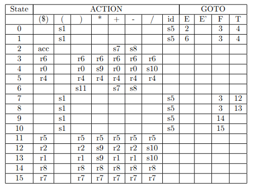
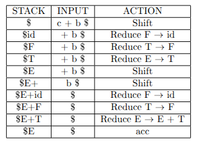

Для сборки проекта:
```
cmake -S . -B build
cmake --build build
```

Для запуска:
```
./build/SLR input.txt
```
При такой сборке результатом работы программы является хеш, который уникален для каждой таблицы - визуализации процесса. Это сделано для тестирования программы.
Запустить тест:
```
cd build
ctest -L end_to_end
```


Также имеется возможность получить SLR таблицу и визуализацию процесса парсинга в явном виде.
Для этого необходимо иметь установленным pdflatex:

```
pdflatex -output-directory=output -interaction=batchmode output/parse.tex > /dev/null

pdflatex -output-directory=output -interaction=batchmode output/SLRtable.tex > /dev/null
```

Наблюдать результат в папке output.


## Сборка с автоматическим графическим дампом:
> **WARN:**  Проблема с кросплатформенностью (используется system для вызова pdflatex и xdg-open)
```
cmake -S . -B build -DPDF_CREATE=ON
cmake --build build
```

Для запуска:
```
./build/SLR input.txt
```


## SLR-parser
Парсер написан для арифметический языка состоящего из сложения, вычитания, умножения, деления и скобок. Операции могут производиться над переменными или же над числами. Имена переменных формируются только из букв латинского алфавита;

Грамматику можно описать через продукции:

E'→ E 

E → E + T | E - T| T

T → T * F | T / F| F

F → (E) | id


> **NOTE:** E'→ E is used to make it easy for automat to recognise when to end

SLR (Simple LR) в компиляторах — это простой метод синтаксического анализа «снизу вверх» (LR), использующий конечный автомат и таблицу разбора для обработки кода.

В ходе работы программы строится таблица SLR (приведена таблица, которая была сгенерирована программой)


На основе которой осуществляются переходы между состояниями автомата.

В частности для входной строки ```a+b$``` получаем таблицу:

